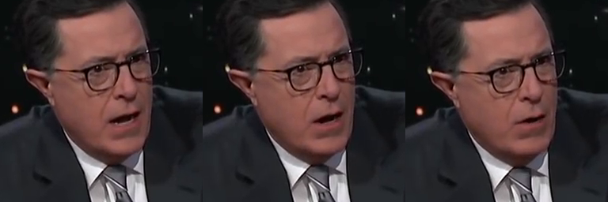

# G3 
Tool intended to generate novel video (sequences of frames) containing human faces displaying microexpressions from existing video of the same. The novel video will be generated via:  

> "a data-driven approach for unsupervised videoretargeting that translates content from one domain to another while preserving the style native to a domain, i.e., if contents of John Oliver’s speech were to be transferred to Stephen Colbert, then the generated con-tent/speech should be in Stephen Colbert’s style." [0]

<hr>
<br>

## High-Level Algorithm (pseudocode):
``` python
def run_unsupervised_video_retargeting(domain_a, domain_b):    
    domains_valid = validate_domains([domain_a, domain_b])
    if domains_valid == False:
        raise ValueError('One of your domains is invalid')
    novel_video = run_recycle_gan(domain_a, domain_b)
    return novel_video

def run_benchmark(micro_expression_db, novel_video):
    micro_expression_db.add(novel_video)
    results = run_benchmark(micro_expression_db)
    return eval_results(results)

novel_video = run_unsupervised_video_retargeting(domain_a, domain_b)
evaluation = run_benchmark(micro_expression_db, novel_video)
print(evaluation)
```

<hr>
<br>

## Domain Specs:
- Each domain should contain somewhere between 7,500 and 10,000 image files.
    - > "For smaller datasets (ones having 1000 images or less), it is suitable to let it train for longer"[0] than 20-40 epochs.
- Each image should contain three contiguous video. frames
    - > "Each image file consists of horizontally concatenated images, "{t, t+1, t+2}" frames from the video."[0]
    
    <small>Image attribution: Better to ask forgiveness than permission (usually)</small>

<hr>
<br>

## More info:
- [Recycle-GAN]('recycle_gan/README.md')
- [Notes about Recycle-GAN]('recycle_gan/README.group3.md')
- [Benchmark]('benchmark_tool/README.md')
- [Notes about Benchmark]('benchmark_tool/README.group3.md')

<hr>
<br>

### References:
[0] Aayush Bansal. “Recycle-GAN: Unsupervised Video Retargeting.” Carnegie-Mellon University.
http://www.cs.cmu.edu/~aayushb/Recycle-GAN/ (accessed September 8, 2020).

[1] Cornell University. “Spotting Macro- and Micro-expression Intervals in Long Video Sequences
.” arXiv. https://arxiv.org/abs/1912.11985 (accessed September 8, 2020).

<hr>
<br>

#### Other Reading:
- Aayush Bansal et al., "4D Visualization of Dynamic Events from
Unconstrained Multi-View Videos"
    - http://www.cs.cmu.edu/~aayushb/Open4D/
    - https://github.com/aayushbansal/Open4D
- David Guera et al., "We Need No Pixels: Video Manipulation Detection Using Stream Descriptors"
    - https://arxiv.org/pdf/1906.08743v1.pdf
    - https://github.com/dguera/fake-video-detection-without-pixels

<hr>
<br>

